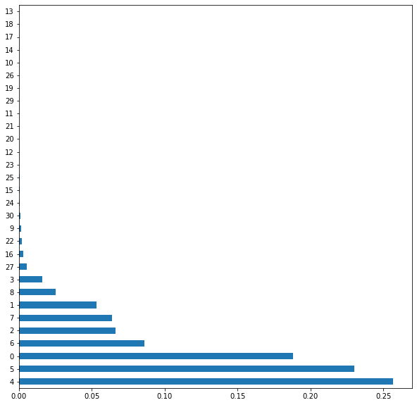
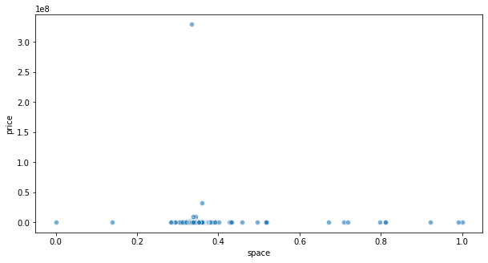
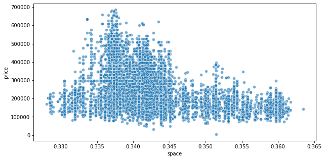

# House Pricing
Houses are expensive. For an average buyer it is quite hard to decide which house to buy. While online house retail sites somewhat alleviate that problem, the sheer amount of data that is present in them is daunting for any user. Wouldn't it be nice if there was an automated software that could predict a fair price for a house, given it's data? This is exactly why we developed this tool for.


## Data description
The first thing to do would be to take a look at our data. In this particular case, data was provided in 2 different datasets, they contain similar information, but given that they have almost the same amount of rows but a few more variables, we decided to only use the one with the most amount of information.


```python
import pandas as pd
import numpy as np
```


```python
df = pd.read_csv('data/data_from_json.csv')
df = df.drop(columns=['Unnamed: 0'])
```

Now lets see the data


```python
df.tail(5)
```


<div>
<style scoped>
    .dataframe tbody tr th:only-of-type {
        vertical-align: middle;
    }

    .dataframe tbody tr th {
        vertical-align: top;
    }

    .dataframe thead th {
        text-align: right;
    }
</style>
<table border="1" class="dataframe">
  <thead>
    <tr style="text-align: right;">
      <th></th>
      <th>price</th>
      <th>space</th>
      <th>room</th>
      <th>bedroom</th>
      <th>furniture</th>
      <th>latitude</th>
      <th>longitude</th>
      <th>city_area</th>
      <th>floor</th>
      <th>max_floor</th>
      <th>apartment_type</th>
      <th>renovation_type</th>
      <th>balcony</th>
    </tr>
  </thead>
  <tbody>
    <tr>
      <th>29199</th>
      <td>179200</td>
      <td>75.00</td>
      <td>2</td>
      <td>1</td>
      <td>0</td>
      <td>41.761308</td>
      <td>44.789730</td>
      <td>Nadzaladevi District</td>
      <td>11</td>
      <td>22</td>
      <td>construction</td>
      <td>green frame</td>
      <td>1</td>
    </tr>
    <tr>
      <th>29200</th>
      <td>126600</td>
      <td>53.00</td>
      <td>2</td>
      <td>1</td>
      <td>0</td>
      <td>41.731884</td>
      <td>44.836876</td>
      <td>Other</td>
      <td>8</td>
      <td>12</td>
      <td>new</td>
      <td>green frame</td>
      <td>1</td>
    </tr>
    <tr>
      <th>29201</th>
      <td>62400</td>
      <td>25.75</td>
      <td>1</td>
      <td>1</td>
      <td>0</td>
      <td>41.731884</td>
      <td>44.836876</td>
      <td>Other</td>
      <td>7</td>
      <td>12</td>
      <td>new</td>
      <td>green frame</td>
      <td>1</td>
    </tr>
    <tr>
      <th>29202</th>
      <td>167200</td>
      <td>70.00</td>
      <td>3</td>
      <td>2</td>
      <td>0</td>
      <td>41.731884</td>
      <td>44.836876</td>
      <td>Other</td>
      <td>4</td>
      <td>12</td>
      <td>new</td>
      <td>green frame</td>
      <td>1</td>
    </tr>
    <tr>
      <th>29203</th>
      <td>169300</td>
      <td>75.00</td>
      <td>3</td>
      <td>2</td>
      <td>0</td>
      <td>41.731884</td>
      <td>44.836876</td>
      <td>Other</td>
      <td>5</td>
      <td>8</td>
      <td>construction</td>
      <td>green frame</td>
      <td>1</td>
    </tr>
  </tbody>
</table>
</div>


```python
df.info()
```

    <class 'pandas.core.frame.DataFrame'>
    RangeIndex: 29204 entries, 0 to 29203
    Data columns (total 13 columns):
     #   Column           Non-Null Count  Dtype  
    ---  ------           --------------  -----  
     0   price            29204 non-null  int64  
     1   space            29204 non-null  float64
     2   room             29204 non-null  int64  
     3   bedroom          29204 non-null  int64  
     4   furniture        29204 non-null  int64  
     5   latitude         28958 non-null  float64
     6   longitude        28958 non-null  float64
     7   city_area        29204 non-null  object 
     8   floor            29204 non-null  int64  
     9   max_floor        29204 non-null  int64  
     10  apartment_type   29194 non-null  object 
     11  renovation_type  29204 non-null  object 
     12  balcony          29204 non-null  int64  
    dtypes: float64(3), int64(7), object(3)
    memory usage: 2.9+ MB
    


```python
df.describe()
```


<div>
<style scoped>
    .dataframe tbody tr th:only-of-type {
        vertical-align: middle;
    }

    .dataframe tbody tr th {
        vertical-align: top;
    }

    .dataframe thead th {
        text-align: right;
    }
</style>
<table border="1" class="dataframe">
  <thead>
    <tr style="text-align: right;">
      <th></th>
      <th>price</th>
      <th>space</th>
      <th>room</th>
      <th>bedroom</th>
      <th>furniture</th>
      <th>latitude</th>
      <th>longitude</th>
      <th>floor</th>
      <th>max_floor</th>
      <th>balcony</th>
    </tr>
  </thead>
  <tbody>
    <tr>
      <th>count</th>
      <td>2.920400e+04</td>
      <td>29204.000000</td>
      <td>29204.000000</td>
      <td>29204.000000</td>
      <td>29204.000000</td>
      <td>28958.000000</td>
      <td>28958.000000</td>
      <td>29204.000000</td>
      <td>29204.000000</td>
      <td>29204.000000</td>
    </tr>
    <tr>
      <th>mean</th>
      <td>2.988408e+05</td>
      <td>87.569128</td>
      <td>2.923298</td>
      <td>1.819751</td>
      <td>0.430592</td>
      <td>41.729477</td>
      <td>44.781414</td>
      <td>6.361663</td>
      <td>10.744556</td>
      <td>0.776092</td>
    </tr>
    <tr>
      <th>std</th>
      <td>1.952151e+06</td>
      <td>45.717693</td>
      <td>1.050128</td>
      <td>0.852494</td>
      <td>0.495168</td>
      <td>0.051541</td>
      <td>0.083022</td>
      <td>4.707854</td>
      <td>5.454033</td>
      <td>0.416868</td>
    </tr>
    <tr>
      <th>min</th>
      <td>3.300000e+03</td>
      <td>13.000000</td>
      <td>1.000000</td>
      <td>0.000000</td>
      <td>0.000000</td>
      <td>40.469229</td>
      <td>38.829869</td>
      <td>0.000000</td>
      <td>0.000000</td>
      <td>0.000000</td>
    </tr>
    <tr>
      <th>25%</th>
      <td>1.483000e+05</td>
      <td>57.000000</td>
      <td>2.000000</td>
      <td>1.000000</td>
      <td>0.000000</td>
      <td>41.708101</td>
      <td>44.753788</td>
      <td>3.000000</td>
      <td>7.000000</td>
      <td>1.000000</td>
    </tr>
    <tr>
      <th>50%</th>
      <td>2.142000e+05</td>
      <td>75.000000</td>
      <td>3.000000</td>
      <td>2.000000</td>
      <td>0.000000</td>
      <td>41.724521</td>
      <td>44.772078</td>
      <td>5.000000</td>
      <td>10.000000</td>
      <td>1.000000</td>
    </tr>
    <tr>
      <th>75%</th>
      <td>3.394000e+05</td>
      <td>105.000000</td>
      <td>3.000000</td>
      <td>2.000000</td>
      <td>1.000000</td>
      <td>41.734181</td>
      <td>44.810649</td>
      <td>9.000000</td>
      <td>14.000000</td>
      <td>1.000000</td>
    </tr>
    <tr>
      <th>max</th>
      <td>3.295100e+08</td>
      <td>530.000000</td>
      <td>14.000000</td>
      <td>4.000000</td>
      <td>1.000000</td>
      <td>44.266066</td>
      <td>47.238277</td>
      <td>127.000000</td>
      <td>113.000000</td>
      <td>1.000000</td>
    </tr>
  </tbody>
</table>
</div>


It seems like we don't have clear outliers, so we will leave them because they might represent an outstanding (or very poor) location. Now lets plot the correlation matrix to see if we have some clear correlation between variables.

## Data Visualization


```python
# Definition of a function to visualize correlation between variables
import seaborn as sn
import matplotlib.pyplot as plt


def plot_correlation(df):
    corr_matrix = df.corr()
    heat_map = sn.heatmap(corr_matrix, annot=False)
    plt.show(heat_map)
```


```python
plot_correlation(df)
```


Given that our target variable is price, we cannot see a clear correlation. Lets proceed divide the data into train and test set. Using the following graph we can see that we don't have clear outliers in our dataset.

pd.plotting.scatter_matrix(df, alpha=0.2, figsize=(10, 10));

## Data preprocessing
We will proceed to separate data into train and test. Once we have our data ready we will begin imputing and normalizing/standardizing.


```python
from sklearn.model_selection import train_test_split

X = df.drop(axis=1, columns='price')
y = df['price']

X_train, X_test, y_train, y_test = train_test_split(
    X, y, test_size=0.20, random_state=123)
```

Now we will separate numerical and categorical variables


```python
# Numerical variable names
num_var = X_train.select_dtypes(np.number).columns
# Categorical variable names
cat_var = X_train.select_dtypes(include=['object', 'bool']).columns
```

### Data Cleaning
This is the time to take care of missing values, we will use KNN-Imputer to deal with numerical missing values and 'most frequent' simple imputer to deal with categorical ones


```python
from sklearn.impute import SimpleImputer
from sklearn.impute import KNNImputer
from sklearn.compose import ColumnTransformer
```


```python
# Creating both numerical and categorical imputer
t1 = ('num_imputer', KNNImputer(n_neighbors=5), num_var)
t2 = ('cat_imputer', SimpleImputer(strategy='most_frequent'),
      cat_var)

column_transformer_cleaning = ColumnTransformer(
    transformers=[t1, t2], remainder='passthrough')

column_transformer_cleaning.fit(X_train)

Train_transformed = column_transformer_cleaning.transform(X_train)
Test_transformed = column_transformer_cleaning.transform(X_test)

# Here we update the order in wich variables are located in the dataframe, given that after transforming, we will have all
# numerical variables first, followed by all the categorical variables.
var_order = num_var.tolist() + cat_var.tolist()

# And finally we recreate the Data Frames
X_train_clean = pd.DataFrame(Train_transformed, columns=var_order)
X_test_clean = pd.DataFrame(Test_transformed, columns=var_order)
```

### Normalizing and Enconding data
Next step is to normalize and enconde data to achieve better performance in our models


```python
from sklearn.preprocessing import MinMaxScaler
from sklearn.preprocessing import OneHotEncoder
```


```python
# We obtain the diferent values in all categorical variables
dif_values = [df[column].dropna().unique() for column in cat_var]
```


```python
# Now we create the transformers
t_norm = ("normalizer", MinMaxScaler(feature_range=(0, 1)), num_var)
t_nominal = ("onehot", OneHotEncoder(
    sparse=False, categories=dif_values), cat_var)
# As the dataset isn't huge, we will set sparse=false
```


```python
column_transformer_norm_enc = ColumnTransformer(transformers=[t_norm, t_nominal],
                                                remainder='passthrough')

column_transformer_norm_enc.fit(X_train_clean);
```


```python
X_train_transformed = column_transformer_norm_enc.transform(X_train_clean)
X_test_transformed = column_transformer_norm_enc.transform(X_test_clean)
```

### Unsupervised learning


```python
from sklearn.cluster import KMeans
```


```python
kmeans = KMeans(
    n_clusters=2, 
    random_state=123
).fit(X_train_transformed)
```


```python
test_cluster = kmeans.predict(X_test_transformed)
```


```python
X_train_transformed = np.append(X_train_transformed, np.expand_dims(kmeans.labels_, axis=1), axis=1)
X_test_transformed = np.append(X_test_transformed, np.expand_dims(test_cluster, axis=1), axis=1)
```

### Feature Engineering


```python
X_val_train, X_val_test, y_val_train, y_val_test = train_test_split(
    X_train_transformed, y_train, test_size=0.30, random_state=123)
```


```python
from sklearn.ensemble import ExtraTreesRegressor
import matplotlib.pyplot as plt
model = ExtraTreesRegressor()
model.fit(X_val_train, y_val_train)
print(model.feature_importances_)
```

    [1.88279024e-01 5.31595550e-02 6.62028485e-02 1.60783376e-02
     2.56854814e-01 2.30141022e-01 8.62513302e-02 6.39541243e-02
     2.50864007e-02 1.30267890e-03 1.67187181e-05 4.46828279e-05
     1.57882755e-04 8.16312705e-06 1.58674287e-05 4.82876694e-04
     2.69620735e-03 1.13453585e-05 9.23340485e-06 1.94127613e-05
     9.37150900e-05 7.44937721e-05 1.75189974e-03 1.60082869e-04
     6.19480330e-04 2.89415264e-04 1.73421107e-05 5.24741647e-03
     4.61917562e-06 4.30801101e-05 9.25929859e-04]
    


```python
feat_importances = pd.Series(model.feature_importances_)
feat_importances.nlargest(30).plot(kind='barh', figsize=(10, 10))
plt.show()
```





```python
X_train_transformed = X_train_transformed[:, [4, 5, 0, 7, 2, 6]]
```


```python
X_test_transformed = X_test_transformed[:, [4, 5, 0, 7, 2, 6]]
```

### Outliers


```python
df_outlier = pd.DataFrame(data=X_train_transformed)
df_outlier = df_outlier.merge(y_train, on=df_outlier.index, indicator = False).drop(axis=1, columns='key_0')

df_outlier_test = pd.DataFrame(data=X_test_transformed)
df_outlier_test = df_outlier_test.merge(y_test, on=df_outlier_test.index, indicator = False).drop(axis=1, columns='key_0')
```


```python
df_outlier = df_outlier.rename(columns={0: "space"})
```


```python
plt.figure(figsize=(10,5))
sn.scatterplot(x='space', y='price', 
                data=df_outlier, alpha=.6)
```


    <matplotlib.axes._subplots.AxesSubplot at 0x19dd8f85670>





```python
from sklearn.ensemble import IsolationForest
```


```python
iso_forest = IsolationForest(contamination=0.5)
iso_forest.fit(df_outlier)
```


    IsolationForest(contamination=0.5)


```python
plt.figure(figsize=(10,5))
sn.scatterplot(x='space', y='price',
                data=df_outlier[iso_forest.predict(df_outlier) == 1], alpha=.6)
```


    <matplotlib.axes._subplots.AxesSubplot at 0x19dd9bd26a0>





```python
df_outlier = df_outlier[iso_forest.predict(df_outlier) == 1]
X_train_transformed = df_outlier.drop(axis=1, columns='price')
y_train = df_outlier['price']
```


```python
df_outlier_test = df_outlier_test[iso_forest.predict(df_outlier_test) == 1]
X_test_transformed = df_outlier_test.drop(axis=1, columns='price')
y_test = df_outlier_test['price']
```

## Model Selection
We will create pipelines to fine tune hyperparameters using Grid Search. This step will take place in the train set to avoid having any contact with the test set (obviously).


```python
from sklearn.model_selection import validation_curve
from sklearn.pipeline import make_pipeline
from sklearn.metrics import make_scorer
from sklearn.model_selection import GridSearchCV
from sklearn.pipeline import Pipeline
from optuna.samplers import TPESampler
import optuna

from sklearn import tree
from sklearn.linear_model import LinearRegression
from sklearn.ensemble import GradientBoostingRegressor
from lightgbm import LGBMRegressor

from sklearn.decomposition import PCA
from sklearn.feature_selection import RFE
```


```python
from sklearn.metrics import mean_squared_error
def root_mean_squared_error(y_true, y_pred):
    ''' Root mean squared error regression loss
    
    Parameters
    ----------
    y_true : array-like of shape = (n_samples) or (n_samples, n_outputs)
    Ground truth (correct) target values.

    y_pred : array-like of shape = (n_samples) or (n_samples, n_outputs)
    Estimated target values.
    '''
    return np.sqrt(mean_squared_error(y_true, y_pred, squared=True))
```


```python
from sklearn.metrics import r2_score, mean_absolute_error, mean_squared_log_error, mean_squared_error

def reg_report(model, X, y):
    print(f"R2 score : {r2_score(y,model.predict(X)):.2f}")
    print(f"MAE loss : {mean_absolute_error(y,model.predict(X)):.2f}")
    print(f"RMSE loss : {np.sqrt(mean_squared_error(y,model.predict(X))):.2f}")
    print(f"error % : {np.sqrt(mean_squared_error(y,model.predict(X)))/np.mean(y):.2f}")
```


```python
X_val_train, X_val_test, y_val_train, y_val_test = train_test_split(
    X_train_transformed, y_train, test_size=0.20, random_state=123)
```

### Grid search for Decision Tree Regressor


```python
rmse_scorer = make_scorer(root_mean_squared_error, greater_is_better=False)
pipe_tree = make_pipeline(tree.DecisionTreeRegressor(random_state=1))

depths = np.arange(1, 21)
num_leafs = [1, 5, 10, 20, 50, 100]

param_grid_tree = [{'decisiontreeregressor__max_depth': depths,
                    'decisiontreeregressor__min_samples_leaf': num_leafs}]
```


```python
gs_tree = GridSearchCV(estimator=pipe_tree,
                       param_grid=param_grid_tree, scoring=rmse_scorer, cv=10)
best_tree = gs_tree.fit(X_val_train, y_val_train)
```


```python
print(reg_report(best_tree, X_val_test, y_val_test))
print('Best attributes: ', best_tree.best_params_)
```

    R2 score : 0.73
    MAE loss : 37877.02
    RMSE loss : 53784.42
    error % : 0.23
    None
    Best attributes:  {'decisiontreeregressor__max_depth': 11, 'decisiontreeregressor__min_samples_leaf': 20}
    

### Grid search for Linear Regression


```python
pipe_lr = make_pipeline(LinearRegression())
fit_intercept = [True, False]
normalize = [True, False]
copy_x = [True, False]

parameters = [{'linearregression__fit_intercept': fit_intercept,
               'linearregression__normalize': normalize, 'linearregression__copy_X': copy_x}]

gs_lr = GridSearchCV(estimator=pipe_lr, param_grid=parameters,
                     scoring=rmse_scorer, cv=10)
best_lr=gs_lr.fit(X_val_train, y_val_train)

```


```python
print(reg_report(best_lr, X_val_test, y_val_test))
print('Best attributes: ', best_lr.best_params_)
```

    R2 score : 0.64
    MAE loss : 45122.19
    RMSE loss : 62226.74
    error % : 0.27
    None
    Best attributes:  {'linearregression__copy_X': True, 'linearregression__fit_intercept': True, 'linearregression__normalize': True}
    

### Grid Search for Gradient Boosting Regressor


```python
ens_model = Pipeline([
    ('reg', GradientBoostingRegressor(random_state=123))
])

ens_search = GridSearchCV(
    ens_model, param_grid={
        'reg__max_depth': [number for number in np.arange(20) if number % 2 != 0],
    }
)


ens_search.fit(X_val_train, y_val_train)
ens_model = ens_search.best_estimator_
```


```python
print(reg_report(ens_search.best_estimator_, X_val_test, y_val_test))
print(ens_search.best_params_)
```

    R2 score : 0.78
    MAE loss : 33832.28
    RMSE loss : 48137.14
    error % : 0.21
    None
    {'reg__max_depth': 7}
    

### Optimizing for LightGBM Regressor


```python
def create_model(trial):
    max_depth = trial.suggest_int("max_depth", 2, 6)
    n_estimators = trial.suggest_int("n_estimators", 1, 100)
    learning_rate = trial.suggest_uniform('learning_rate', 0.0000001, 1)
    num_leaves = trial.suggest_int("num_leaves", 2, 5000)
    min_child_samples = trial.suggest_int('min_child_samples', 3, 200)
    model = LGBMRegressor(
        learning_rate=learning_rate,
        n_estimators=n_estimators,
        max_depth=max_depth,
        num_leaves=num_leaves,
        min_child_samples=min_child_samples,
        random_state=123
    )
    return model


sampler = TPESampler(seed=123)


def objective(trial):
    model = create_model(trial)
    model.fit(X_val_train, y_val_train)
    preds = model.predict(X_val_test)
    return np.sqrt(mean_squared_error(y_val_test, preds))


study = optuna.create_study(direction="minimize", sampler=sampler)
study.optimize(objective, n_trials=400)

```


```python
lgb_params = study.best_params
lgb_params['random_state'] = 123
lgb = LGBMRegressor(**lgb_params)
lgb.fit(X_val_train, y_val_train)

print(reg_report(lgb,X_val_test,y_val_test))
print(lgb_params)
```

    R2 score : 0.79
    MAE loss : 33391.78
    RMSE loss : 47456.40
    error % : 0.20
    None
    {'max_depth': 6, 'n_estimators': 100, 'learning_rate': 0.22222685669158865, 'num_leaves': 325, 'min_child_samples': 4, 'random_state': 123}
    

### Data Postprocessing


```python
for i in range(1, 10):
    rfe = RFE(
        estimator=LGBMRegressor(
            learning_rate=lgb_params.get('learning_rate'),
            n_estimators=lgb_params.get('n_estimators'),
            max_depth=lgb_params.get('max_depth'),
            num_leaves=lgb_params.get('num_leaves'),
            min_child_samples=lgb_params.get('min_child_samples'),
            random_state=123
        ),
        n_features_to_select=i
    )
    pipeline = Pipeline(
        steps=[
            ('s', rfe),
            ('m', LGBMRegressor(
                learning_rate=lgb_params.get('learning_rate'),
                n_estimators=lgb_params.get('n_estimators'),
                max_depth=lgb_params.get('max_depth'),
                num_leaves=lgb_params.get('num_leaves'),
                min_child_samples=lgb_params.get('min_child_samples'),
                random_state=123
            ))
        ]
    )
    pipeline.fit(X_val_train, y_val_train)
    preds = pipeline.predict(X_val_test)

    print('Number of features: ', i)
    print(reg_report(pipeline, X_val_test, y_val_test))
```

    Number of features:  1
    R2 score : 0.25
    MAE loss : 66934.17
    RMSE loss : 89096.97
    error % : 0.38
    None
    Number of features:  2
    R2 score : 0.69
    MAE loss : 40620.99
    RMSE loss : 57561.01
    error % : 0.25
    None
    Number of features:  3
    R2 score : 0.75
    MAE loss : 36078.46
    RMSE loss : 51530.77
    error % : 0.22
    None
    Number of features:  4
    R2 score : 0.78
    MAE loss : 33649.60
    RMSE loss : 48451.59
    error % : 0.21
    None
    Number of features:  5
    R2 score : 0.78
    MAE loss : 33594.73
    RMSE loss : 48805.13
    error % : 0.21
    None
    Number of features:  6
    R2 score : 0.79
    MAE loss : 33391.78
    RMSE loss : 47456.40
    error % : 0.20
    None
    Number of features:  7
    R2 score : 0.79
    MAE loss : 33391.78
    RMSE loss : 47456.40
    error % : 0.20
    None
    Number of features:  8
    R2 score : 0.79
    MAE loss : 33391.78
    RMSE loss : 47456.40
    error % : 0.20
    None
    Number of features:  9
    R2 score : 0.79
    MAE loss : 33391.78
    RMSE loss : 47456.40
    error % : 0.20
    None
    

## Model Training
Our winner is **Gradient Boosting Regressor**. Now it's time to train that model with all of our train data to obtain the *down to earth* performance of our model.


```python
model = LGBMRegressor(
    learning_rate=lgb_params.get('learning_rate'),
    n_estimators=lgb_params.get('n_estimators'),
    max_depth=lgb_params.get('max_depth'),
    num_leaves=lgb_params.get('num_leaves'),
    min_child_samples=lgb_params.get('min_child_samples'),
    random_state=123
)
model.fit(X_train_transformed, y_train)

print(reg_report(model, X_test_transformed, y_test))
```

    R2 score : 0.79
    MAE loss : 31586.87
    RMSE loss : 46046.26
    error % : 0.20
    None
    

## Conclusion
To conclude, we created this tool to predict house pricing based on certain parameters. We achieved a RMSE of 46046.26 U$D
